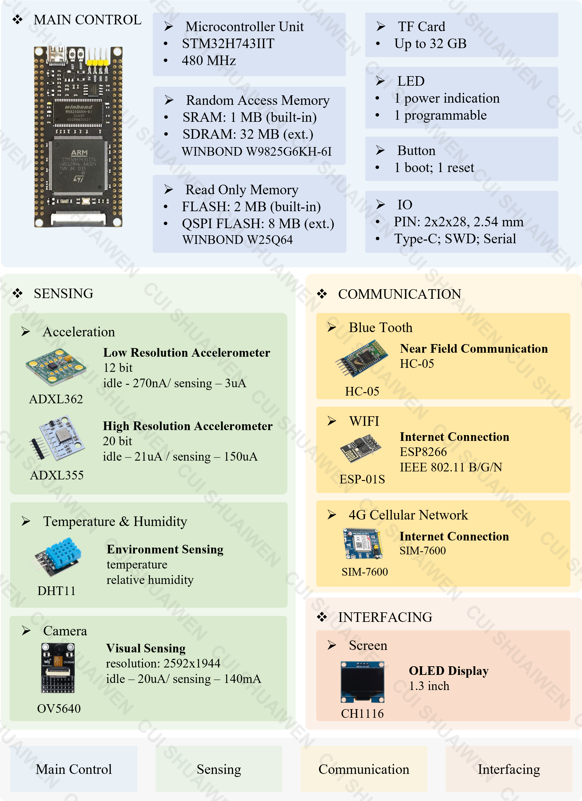
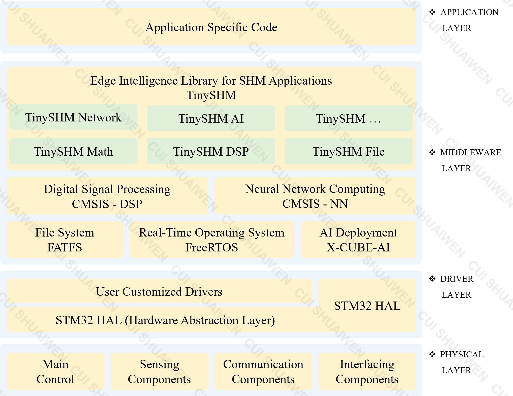

# 架构

## 硬件架构

为了展示 TinySHM 的功能和特性，TinySHM 使用 LiftNode 作为物理基础。LiftNode 是一种 MCU 级别的低成本、低功耗、高性能的传感节点，专门为各种结构健康监测应用而设计。

-   :fontawesome-brands-github:{ .lg .middle } __LiftNode仓库__

    ---

    LiftNode 的 Github 仓库。

    [:octicons-arrow-right-24: <a href="https://github.com/Shuaiwen-Cui/MCU_NODE_STM32" target="_blank"> 仓库 </a>](#)

-   :fontawesome-brands-github:{ .lg .middle } __LiftNode文档__

    ---

    LiftNode 的文档。

    [:octicons-arrow-right-24: <a href="https://shuaiwen-cui.github.io/MCU_NODE_STM32/" target="_blank"> 地址 </a>](#)

## 软件架构

这里展示的实际上是LiftNode的软件架构，TinySHM作为其中间层的一部分，主要作为中间件使用，向下对接底层驱动，向上支撑应用层的功能。TinySHM作为一个框架，旨在弥合通用计算和结构健康监测特定计算之间的差距，为结构健康监测应用提供高度抽象、可配置、节能、高性能的功能。
