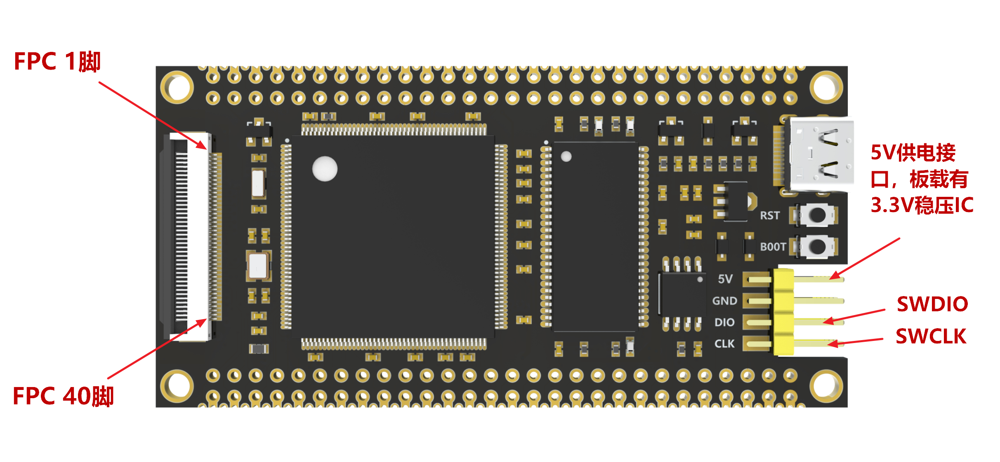

# DEVKITS

## HOST MCU HARDWARES

- DNESP32S3M from Alientek (ESP32-S3)

{width=800px}

{width=800px}

<!-- - DNESP32S3 from Alientek (ESP32-S3)

{width=70%}

{width=70%} -->

<!-- - FK743M2-IIT6 from FANKE (STM32H743)

{width=80%}

{width=70%} -->

## DEB BOARDS SETUP GUIDANCE

-   :simple-github:{ .lg .middle } __NexNode__

    ---

    [:octicons-arrow-right-24: <a href="https://github.com/Shuaiwen-Cui/NexNode.git" target="_blank"> Repo </a>](#)

    [:octicons-arrow-right-24: <a href="https://shuaiwen-cui.github.io/NexNode/" target="_blank"> Online Doc </a>](#)

