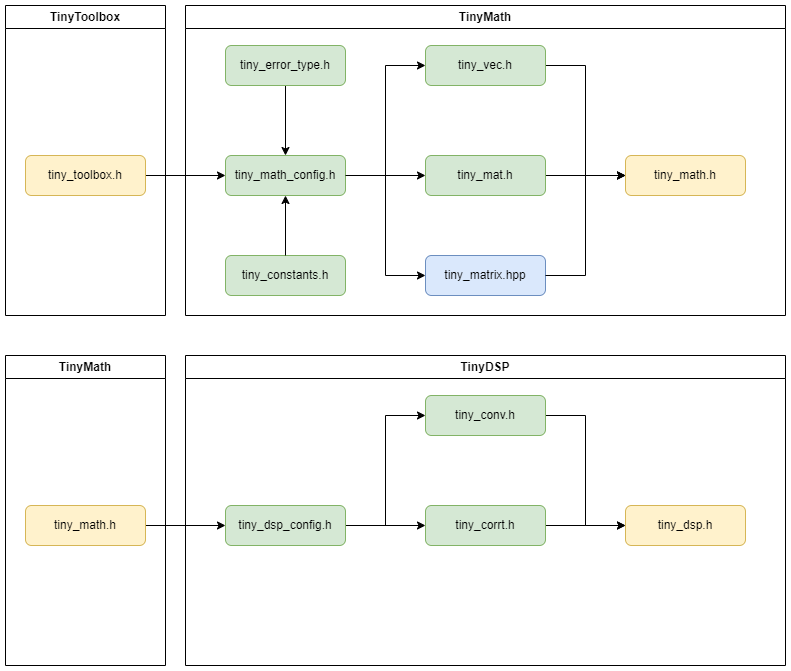

# 数字信号处理

!!! note
    该组件用于旨在为边缘设备提供信号处理的一系列函数，设计主旨为轻量高效，范围为常用重要的信号处理算法。

!!! note
    该组件基于ESP32官方数字信号处理库 [ESP-DSP](https://docs.espressif.com/projects/esp-dsp/en/latest/esp32/index.html) 进行封装和扩展，提供了更高层次的API接口。先前TinyMath已经对应了ESP-DSP中的Math, Matrix, DotProduct模块，ESP-DSP中的其余模块对应本组件TinyDSP库。除此以外，TinyDSP还提供了ESP-DSP中未曾提供的一些功能，重点覆盖结构健康监测等场景。


## 组件依赖

```c
set(src_dirs
    .
    signal
    filter
    transform
    support
)

set(include_dirs
    .
    include
    signal
    filter
    transform
    support
)

set(requires
    tiny_math
)

idf_component_register(SRC_DIRS ${src_dirs} INCLUDE_DIRS ${include_dirs} REQUIRES ${requires})


```

## 架构与功能目录

### 依赖关系示意图



### 代码树

```txt
tiny_dsp/
├── include/                     
│   ├── tiny_dsp.h               # entrance header file
│   └── tiny_dsp_config.h        # dsp module configuration file
│
├── signal/
│   ├── tiny_conv.h              # convolution - header file
│   ├── tiny_conv.c              # convolution - source file
│   ├── tiny_corr.h              # correlation - header file
│   └── tiny_corr.c              # correlation - source file
│
├── filter/
│
├── transform/
│
└── support/
```