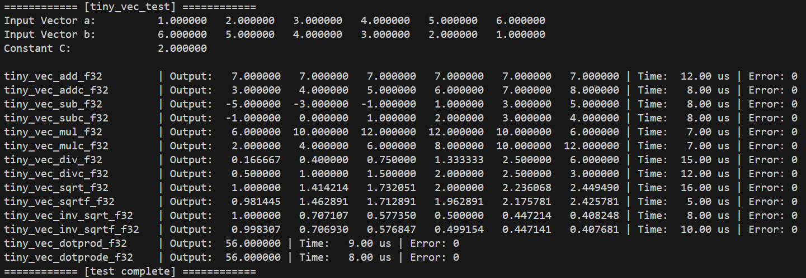

# 向量操作测试

!!! note "向量操作测试"
    该测试用于测试向量相关函数的性能。

## 测试代码

### tiny_vec_test.h

```c
/**
 * @file tiny_vec_test.h
 * @author SHUAIWEN CUI (SHUAIWEN001@e.ntu.edu.sg)
 * @brief This file is the test header file for the submodule vec of the tiny_math middleware.
 * @version 1.0
 * @date 2025-04-15
 * @copyright Copyright (c) 2025
 */

#ifndef __TINY_VEC_TEST_H__
#define __TINY_VEC_TEST_H__

#include "tiny_math_config.h"
#include "tiny_vec.h"

#ifdef __cplusplus
extern "C"
{
#endif

    /**
     * @name tiny_vec_test
     * @brief Run unit tests and timing benchmarks for the tiny_vec module.
     */
    void tiny_vec_test(void);

#ifdef __cplusplus
}
#endif

/** End of __TINY_VEC_TEST_H__ */
#endif /* __TINY_VEC_TEST_H__ */
```

### tiny_vec_test.c

```c
/**
 * @file tiny_vec_test.c
 * @author SHUAIWEN CUI (SHUAIWEN001@e.ntu.edu.sg)
 * @brief This file implements test functions for the submodule vec of the tiny_math middleware.
 * @version 1.0
 * @date 2025-04-15
 * @copyright Copyright (c) 2025
 */

#include "tiny_vec_test.h"

#define LEN 6

#define RUN_VEC_TEST(FUNC, ...)                              \
    do                                                       \
    {                                                        \
        TinyTimeMark_t t0 = tiny_get_running_time();         \
        tiny_error_t err = FUNC(__VA_ARGS__);                \
        TinyTimeMark_t t1 = tiny_get_running_time();         \
        double dt = (double)(t1 - t0);                       \
        printf("%-24s | Output: ", #FUNC);                   \
        for (int i = 0; i < LEN; i++)                        \
        {                                                    \
            printf("%10.6f ", out[i]);                       \
        }                                                    \
        printf("| Time: %6.2f us | Error: %d\n\r", dt, err); \
    } while (0)

void tiny_vec_test(void)
{
    float a[] = {1.0f, 2.0f, 3.0f, 4.0f, 5.0f, 6.0f};
    float b[] = {6.0f, 5.0f, 4.0f, 3.0f, 2.0f, 1.0f};
    float out[LEN];
    float C = 2.0f;
    float dot_result = 0.0f;

    printf("============ [tiny_vec_test] ============\n\r");

    printf("Input Vector a:        ");
    for (int i = 0; i < LEN; i++)
        printf("%10.6f ", a[i]);
    printf("\n\r");

    printf("Input Vector b:        ");
    for (int i = 0; i < LEN; i++)
        printf("%10.6f ", b[i]);
    printf("\n\r");

    printf("Constant C:            %10.6f\n\r\n\r", C);

    RUN_VEC_TEST(tiny_vec_add_f32, a, b, out, LEN, 1, 1, 1);
    RUN_VEC_TEST(tiny_vec_addc_f32, a, out, LEN, C, 1, 1);
    RUN_VEC_TEST(tiny_vec_sub_f32, a, b, out, LEN, 1, 1, 1);
    RUN_VEC_TEST(tiny_vec_subc_f32, a, out, LEN, C, 1, 1);
    RUN_VEC_TEST(tiny_vec_mul_f32, a, b, out, LEN, 1, 1, 1);
    RUN_VEC_TEST(tiny_vec_mulc_f32, a, out, LEN, C, 1, 1);
    RUN_VEC_TEST(tiny_vec_div_f32, a, b, out, LEN, 1, 1, 1, true);
    RUN_VEC_TEST(tiny_vec_divc_f32, a, out, LEN, C, 1, 1, true);
    RUN_VEC_TEST(tiny_vec_sqrt_f32, a, out, LEN);
    RUN_VEC_TEST(tiny_vec_sqrtf_f32, a, out, LEN);
    RUN_VEC_TEST(tiny_vec_inv_sqrt_f32, a, out, LEN);
    RUN_VEC_TEST(tiny_vec_inv_sqrtf_f32, a, out, LEN);

    // Dot product (non-strided)
    {
        TinyTimeMark_t t0 = tiny_get_running_time();
        tiny_error_t err = tiny_vec_dotprod_f32(a, b, &dot_result, LEN);
        TinyTimeMark_t t1 = tiny_get_running_time();
        double dt = (double)(t1 - t0);
        printf("%-24s | Output: %10.6f | Time: %6.2f us | Error: %d\n\r", "tiny_vec_dotprod_f32", dot_result, dt, err);
    }

    // Dot product (strided)
    {
        TinyTimeMark_t t0 = tiny_get_running_time();
        tiny_error_t err = tiny_vec_dotprode_f32(a, b, &dot_result, LEN, 1, 1);
        TinyTimeMark_t t1 = tiny_get_running_time();
        double dt = (double)(t1 - t0);
        printf("%-24s | Output: %10.6f | Time: %6.2f us | Error: %d\n\r", "tiny_vec_dotprode_f32", dot_result, dt, err);
    }

    printf("============ [test complete] ============\n\r");
}
```

## 测试结果

