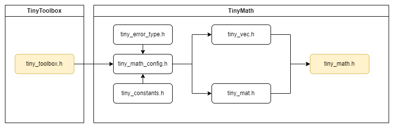

# 数学运算

!!! note
    该组件用于 **数学运算** ，是一个轻量级的库，提供基本的数学函数，以便于板载计算和AI模型推理。该库设计为 **轻量高效** ，适合边缘计算应用。

!!! note
    该组件基于ESP32官方数字信号处理库 [ESP-DSP](https://docs.espressif.com/projects/esp-dsp/en/latest/esp32/index.html) 进行封装和扩展，提供了更高层次的API接口。简单来说，TinyMath库对应ESP-DSP中的Math, Matrix, DotProduct模块，ESP-DSP中的其余模块对应TinyDSP库。


## 组件依赖

```c
set(src_dirs
    .
    vec
    mat
)

set(include_dirs
    .
    include
    vec
    mat
)

set(requires
    tiny_toolbox
)

idf_component_register(SRC_DIRS ${src_dirs} INCLUDE_DIRS ${include_dirs} REQUIRES ${requires})

```

## 架构与功能目录

### 依赖关系示意图


### 代码树

```txt
TinyMath
    ├── CMakeLists.txt
    ├── include
    |   ├── tiny_error_type.h // error type header file
    |   ├── tiny_constant.h // constant header file
    |   ├── tiny_math_config.h // configuration header file
    |   └── tiny_math.h // main header file, include this file where you want to use the library
    ├── vec
    |   ├── tiny_vec.h // vector header file
    |   ├── tiny_vec.c // vector source file
    |   ├── tiny_vec_test.c // vector test file
    |   └── tiny_vec_test.h // vector test header file
    ├── mat
    |   ├── tiny_mat.h // matrix header file - c
    |   ├── tiny_mat.c // matrix source file - c
    |   ├── tiny_mat_test.c // matrix test file - c 
    |   ├── tiny_mat_test.h // matrix test header file - c
    |   ├── tiny_matrix.hpp // matrix header file - cpp
    |   ├── tiny_matrix.cpp // matrix source file - cpp
    |   ├── tiny_matrix_test.cpp // matrix test file - cpp
    |   └── tiny_matrix_test.hpp // matrix test header file - cpp
    └── ...
```

