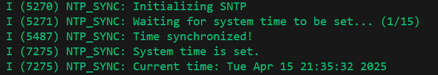

# TIME

!!! info "Time"
    Time related functions are of vital importance for MCU devices. This section provides a series of time related definitions and functions for developers to use.

In MCU, time can be divided into the following types:

- **Running Time:** The time from the power-on of the MCU to now.

- **World Time:** The time of the time zone where the MCU is located. World time can be represented by standard year, month, day, hour, minute, and second, or it can be represented as a UNIX timestamp.

## RUNNING TIME

ESP has its own function to get the running time, `esp_timer_get_time`, which depends on the `esp_timer` library. This function returns the time from power-on to now, in microseconds.

To facilitate usage, TinyToolbox redefines the data type `TinyTimeMark_t` and provides a function `tiny_get_running_time` to get the running time. The time returned by this function is in the unit of TickType_t, which is the time unit defined in FreeRTOS.

```c
typedef TickType_t TinyTimeMark_t;
```

```c

/**
 * @brief Get the running time in microseconds
 * @return TinyTimeMark_t
 */
TinyTimeMark_t tiny_get_running_time(void)
{
    return esp_timer_get_time();
}
```

Usage reference:

```c
void app_main(void)
{
    // Get running time
    TinyTimeMark_t running_time = tiny_get_running_time();
    ESP_LOGI(TAG_TIME, "Running Time: %lld us", running_time);
}
```


## WORLD TIME

!!! warning 
    Note that obtaining world time requires a successful network connection. In other words, the function to obtain world time needs to be called after the network connection is successfully established.

### NTP TIME SYNCHRONIZATION
!!! note "NTP Time Synchronization"
    NTP (Network Time Protocol) is a protocol used to synchronize time in computer networks. It can obtain accurate time information through the Internet or local area network.
    NTP protocol uses UDP for communication, with the default port being 123. NTP servers periodically send time information to clients, and clients adjust their system time based on this information.

```txt
    Client                      Server
      |------------------->      |     T1：Request sent
      |                          |
      |         <--------------- |     T2/T3：Server received & replied
      |                          |
      |------------------->      |     T4：Client received response
```
!!! note "NTP Time Synchronization Principle"
    NTP time synchronization is based on four timestamps: 1. Timestamp T1 when the client sends the request 2. Timestamp T2 when the server receives the request 3. Timestamp T3 when the server sends the response 4. Timestamp T4 when the client receives the response. Based on these four timestamps, we can calculate **Network Delay** Delay = (T4 - T1) - (T3 - T2), and **Time Offset** Offset = ((T2 - T1) + (T3 - T4)) / 2.

!!! note "ESP32 SNTP Time Synchronization"
    In ESP32, SNTP (Simple Network Time Protocol) is used. SNTP is a simplified version of NTP, suitable for scenarios where time accuracy is not critical. The time synchronization in ESP32 relies on the `esp_sntp` library. The working principle of SNTP is similar to that of NTP, but the implementation of SNTP is relatively simple, making it suitable for embedded devices. Its accuracy is usually at the millisecond level, which is sufficient for most application scenarios.

First, define a callback function to receive time synchronization notifications:

```c
/* WORLD CURRENT TIME - SNTP */
/**
 * @brief Callback function for time synchronization notification
 * @param tv Pointer to the timeval structure containing the synchronized time
 * @return None
 */
void time_sync_notification_cb(struct timeval *tv)
{
    ESP_LOGI(TAG_SNTP, "Time synchronized!");
}

```
Next is the SNTP initialization function, which is also the core function of time synchronization. It is usually called when the system is initialized and the network is connected. Note that the time synchronization server address can be modified as needed. After the time synchronization is completed, ESP32 will set the local time at the bottom layer.

```c
/**
 * @brief Initialize SNTP
 * @return None
 */
void initialize_sntp(void)
{
    ESP_LOGI(TAG_SNTP, "Initializing SNTP");
    sntp_setoperatingmode(SNTP_OPMODE_POLL);
    sntp_setservername(0, "pool.ntp.org"); // NTP server // pool.ntp.org // ntp.aliyun.com
    sntp_set_time_sync_notification_cb(time_sync_notification_cb);
    sntp_init();
}
```

Next is a further encapsulation of the above functions, including time zone settings. Note that the following function includes the RTC setting `rtc_set_time`, which depends on the RTC driver at the driver layer. Here I use my custom rtc driver, if there is no related function, you can comment it out directly.

```c
/**
 * @brief Obtain the current time with timezone
 * @param timezone_str Timezone string (e.g., "CST-8")
 * @note The timezone string should be in the format "TZ=GMT+/-HH:MM"
 * @note To use this function, in application, after internet connection, insert "sync_time_with_timezone("CST-8");" will do
 * @return None
 */
void sync_time_with_timezone(const char *timezone_str)
{
    // Set system timezone
    setenv("TZ", timezone_str, 1);
    tzset();

    // Initialize SNTP and start time sync
    initialize_sntp();

    // Wait for system time to be set
    time_t now = 0;
    struct tm timeinfo = { 0 };
    int retry = 0;
    const int retry_count = 15;

    while (timeinfo.tm_year < (2020 - 1900) && ++retry < retry_count) {
        ESP_LOGI(TAG_SNTP, "Waiting for system time to be set... (%d/%d)", retry, retry_count);
        vTaskDelay(2000 / portTICK_PERIOD_MS);
        time(&now);
        localtime_r(&now, &timeinfo);
    }

    if (timeinfo.tm_year >= (2020 - 1900)) {
        rtc_set_time(timeinfo.tm_year + 1900, timeinfo.tm_mon + 1, timeinfo.tm_mday,
                    timeinfo.tm_hour, timeinfo.tm_min, timeinfo.tm_sec); // defined in esp_rtc.c
        ESP_LOGI(TAG_SNTP, "System time is set.");
    } else {
        ESP_LOGW(TAG_SNTP, "Failed to sync time.");
        return;
    }

    // Log current local time
    ESP_LOGI(TAG_SNTP, "Current time: %s", asctime(&timeinfo));

    // vTaskDelay(10000 / portTICK_PERIOD_MS); // Wait for 10 second
    // rtc_get_time(); // uncomment to check the RTC time
    // ESP_LOGI(TAG_SNTP, "Current RTC time: %04d-%02d-%02d %02d:%02d:%02d",
    //          calendar.year, calendar.month, calendar.date,
    //          calendar.hour, calendar.min, calendar.sec); // uncomment to check the RTC time

}

```

### WORLD TIME GETTING

In order to facilitate the acquisition of world time, we first define a data structure `DateTime_t` to store information such as year, month, day, hour, minute, and second. Then we define a function `tiny_get_current_time` to obtain the current world time. This function returns a `DateTime_t` structure, which contains the current year, month, day, hour, minute, and second information. When using it, pass in a Boolean value `print_flag` to control whether to print the current time.

```c
/**
 * @brief Structure to hold date and time
 */
typedef struct TinyDateTime_t
{
    int year;
    int month;
    int day;
    int hour;
    int minute;
    int second;
    long microsecond;
} TinyDateTime_t; 
```

```c
/* WORLD CURRENT TIME - GET TIME */
/**
 * @name tiny_get_current_time
 * @brief Get the current time as a TinyDateTime_t struct
 * @param print_flag Flag to indicate whether to print the time
 * @return TinyDateTime_t structure containing the current date and time
 */
TinyDateTime_t tiny_get_current_time(bool print_flag)
{
    struct timeval tv;
    gettimeofday(&tv, NULL);  // Get current time (seconds + microseconds)

    time_t now = tv.tv_sec;
    struct tm timeinfo;
    localtime_r(&now, &timeinfo);  // Convert to local time

    TinyDateTime_t result;
    result.year   = timeinfo.tm_year + 1900;
    result.month  = timeinfo.tm_mon + 1;
    result.day    = timeinfo.tm_mday;
    result.hour   = timeinfo.tm_hour;
    result.minute = timeinfo.tm_min;
    result.second = timeinfo.tm_sec;
    result.microsecond = tv.tv_usec;

    if (print_flag)
    {
        ESP_LOGI(TAG_TIME, "Current Time: %04d-%02d-%02d %02d:%02d:%02d.%06ld",
                 result.year, result.month, result.day,
                 result.hour, result.minute, result.second, tv.tv_usec);
    }

    return result;
}
```

Usage

```c
void app_main(void)
{
    // Initialize SNTP and sync time
    sync_time_with_timezone("CST-8");

    // Get current time
    TinyDateTime_t current_time = tiny_get_current_time(true);

    // Print current time
    ESP_LOGI(TAG_TIME, "Current Time: %04d-%02d-%02d %02d:%02d:%02d.%06ld",
             current_time.year, current_time.month, current_time.day,
             current_time.hour, current_time.minute, current_time.second, current_time.microsecond);
}
```

Example Output



!!! danger
    The SNTP accuracy is at **ms** level.