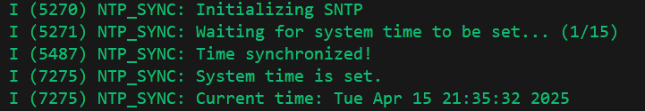

# 时间

!!! note "时间"
    时间相关的功能对于MCU来说非常重要，本节提供一系列时间相关的定义和函数，供开发者使用。

MCU中的时间可以分以下几种类型：

- **运行时间：** 指的是MCU从上电到现在的时间。

- **世界时间：** 指的是MCU所在的时区的时间。世界时间可以通过标准的年月日时分秒来表示，也可以表示为UNIX时间戳。

## 运行时间

ESP有自己的获取运行时间的函数`esp_timer_get_time`，依赖于`esp_timer`库。该函数返回从上电到现在的时间，单位为微秒。

为了方便使用，TinyToolbox重新定义了数据类型`TinyTimeMark_t`，并提供了一个函数`tiny_get_running_time`来获取运行时间。该函数返回的时间单位为TickType_t，TickType_t是FreeRTOS中定义的时间单位。

```c
typedef TickType_t TinyTimeMark_t;
```

```c
/**
 * @brief Get the running time in microseconds
 * @return TinyTimeMark_t
 */
TinyTimeMark_t tiny_get_running_time(void)
{
    return esp_timer_get_time();
}
```

使用参考：

```c
void app_main(void)
{
    // Get running time
    TinyTimeMark_t running_time = tiny_get_running_time();
    ESP_LOGI(TAG_TIME, "Running Time: %lld us", running_time);
}
```

## 世界时间

!!! warning 
    注意，获取世界时间需要建立在已经联网的基础上。也就是说，获取世界时间的函数需要在联网成功后调用。

### NTP对时

!!! note "NTP对时"
    NTP（Network Time Protocol）是网络时间协议的缩写，是一种用于在计算机网络中同步时间的协议。它可以通过互联网或局域网获取准确的时间信息。
    NTP协议使用UDP协议进行通信，默认使用123端口。NTP服务器会定期向客户端发送时间信息，客户端根据这些信息来校正自己的系统时间。

```txt
   Client                      Server
     |------------------->      |     T1：请求发出
     |                          |
     |         <--------------- |     T2/T3：服务器收到 & 回复
     |                          |
     |------------------->      |     T4：客户端收到响应
```

!!! note "NTP对时原理"
    NTP对时是基于四个时间戳：1. 客户端发送请求时的时间戳T1 2. 服务器接收到请求时的时间戳T2 3. 服务器发送响应时的时间戳T3 4. 客户端接收到响应时的时间戳T4。根据这四个时间戳，可以计算 **网络延迟** Delay = (T4 - T1) - (T3 - T2)，以及 **时间偏移** Offset = ((T2 - T1) + (T3 - T4)) / 2。

!!! note "ESP32 SNTP对时"
    ESP32中使用的是SNTP，也就是Simple Network Time Protocol。SNTP是NTP的简化版，适用于对时间精度要求不高的场景。ESP32中对时依赖于`esp_sntp`库。SNTP的工作原理与NTP类似，但SNTP的实现相对简单，适合嵌入式设备使用。其精度通常在ms级别，适用于大多数应用场景。

首先定义一个回调函数，用于接收对时通知：

```c
/* WORLD CURRENT TIME - SNTP */
/**
 * @brief Callback function for time synchronization notification
 * @param tv Pointer to the timeval structure containing the synchronized time
 * @return None
 */
void time_sync_notification_cb(struct timeval *tv)
{
    ESP_LOGI(TAG_SNTP, "Time synchronized!");
}

```
接下来是SNTP的初始化函数，也是对时的核心函数，通常在系统初始化时，完成联网后调用。注意其中的对时服务器地址可以根据需要进行修改。对时完成后，ESP32会在底层对本机时间进行设置。

```c

/**
 * @brief Initialize SNTP
 * @return None
 */
void initialize_sntp(void)
{
    ESP_LOGI(TAG_SNTP, "Initializing SNTP");
    sntp_setoperatingmode(SNTP_OPMODE_POLL);
    sntp_setservername(0, "pool.ntp.org"); // NTP server // pool.ntp.org // ntp.aliyun.com
    sntp_set_time_sync_notification_cb(time_sync_notification_cb);
    sntp_init();
}
```

再接下来是对以上函数的进一步封装，包含了时区设置。注意以下函数中包括了对RTC的设置`rtc_set_time`，依赖于driver层的RTC驱动。此处使用的是我自定义的rtc驱动，若没有相关功能可以直接注释掉。

```c
/**
 * @brief Obtain the current time with timezone
 * @param timezone_str Timezone string (e.g., "CST-8")
 * @note The timezone string should be in the format "TZ=GMT+/-HH:MM"
 * @note To use this function, in application, after internet connection, insert "sync_time_with_timezone("CST-8");" will do
 * @return None
 */
void sync_time_with_timezone(const char *timezone_str)
{
    // Set system timezone
    setenv("TZ", timezone_str, 1);
    tzset();

    // Initialize SNTP and start time sync
    initialize_sntp();

    // Wait for system time to be set
    time_t now = 0;
    struct tm timeinfo = { 0 };
    int retry = 0;
    const int retry_count = 15;

    while (timeinfo.tm_year < (2020 - 1900) && ++retry < retry_count) {
        ESP_LOGI(TAG_SNTP, "Waiting for system time to be set... (%d/%d)", retry, retry_count);
        vTaskDelay(2000 / portTICK_PERIOD_MS);
        time(&now);
        localtime_r(&now, &timeinfo);
    }

    if (timeinfo.tm_year >= (2020 - 1900)) {
        rtc_set_time(timeinfo.tm_year + 1900, timeinfo.tm_mon + 1, timeinfo.tm_mday,
                    timeinfo.tm_hour, timeinfo.tm_min, timeinfo.tm_sec); // defined in esp_rtc.c
        ESP_LOGI(TAG_SNTP, "System time is set.");
    } else {
        ESP_LOGW(TAG_SNTP, "Failed to sync time.");
        return;
    }

    // Log current local time
    ESP_LOGI(TAG_SNTP, "Current time: %s", asctime(&timeinfo));

    // vTaskDelay(10000 / portTICK_PERIOD_MS); // Wait for 10 second
    // rtc_get_time(); // uncomment to check the RTC time
    // ESP_LOGI(TAG_SNTP, "Current RTC time: %04d-%02d-%02d %02d:%02d:%02d",
    //          calendar.year, calendar.month, calendar.date,
    //          calendar.hour, calendar.min, calendar.sec); // uncomment to check the RTC time

}

```

### 世界时间获取

为了方便世界时间的获取，我们首先定义了一个数据结构`DateTime_t`，用于存储年月日时分秒等信息。然后定义了一个函数`tiny_get_current_time`，用于获取当前的世界时间。该函数返回一个`DateTime_t`结构体，包含了当前的年月日时分秒等信息。在使用时，传入一个布尔值`print_flag`，用于控制是否打印当前时间。

```c
/**
 * @brief Structure to hold date and time
 */
typedef struct TinyDateTime_t
{
    int year;
    int month;
    int day;
    int hour;
    int minute;
    int second;
    long microsecond;
} TinyDateTime_t; 
```

```c
/* WORLD CURRENT TIME - GET TIME */
/**
 * @name tiny_get_current_time
 * @brief Get the current time as a TinyDateTime_t struct
 * @param print_flag Flag to indicate whether to print the time
 * @return TinyDateTime_t structure containing the current date and time
 */
TinyDateTime_t tiny_get_current_time(bool print_flag)
{
    struct timeval tv;
    gettimeofday(&tv, NULL);  // Get current time (seconds + microseconds)

    time_t now = tv.tv_sec;
    struct tm timeinfo;
    localtime_r(&now, &timeinfo);  // Convert to local time

    TinyDateTime_t result;
    result.year   = timeinfo.tm_year + 1900;
    result.month  = timeinfo.tm_mon + 1;
    result.day    = timeinfo.tm_mday;
    result.hour   = timeinfo.tm_hour;
    result.minute = timeinfo.tm_min;
    result.second = timeinfo.tm_sec;
    result.microsecond = tv.tv_usec;

    if (print_flag)
    {
        ESP_LOGI(TAG_TIME, "Current Time: %04d-%02d-%02d %02d:%02d:%02d.%06ld",
                 result.year, result.month, result.day,
                 result.hour, result.minute, result.second, tv.tv_usec);
    }

    return result;
}
```
使用参考：

```c
void app_main(void)
{
    // Initialize SNTP and sync time
    sync_time_with_timezone("CST-8");

    // Get current time
    TinyDateTime_t current_time = tiny_get_current_time(true);

    // Print current time
    ESP_LOGI(TAG_TIME, "Current Time: %04d-%02d-%02d %02d:%02d:%02d.%06ld",
             current_time.year, current_time.month, current_time.day,
             current_time.hour, current_time.minute, current_time.second, current_time.microsecond);
}
```

使用效果：



!!! danger
    SNTP的对时精度在 **ms** 水平。